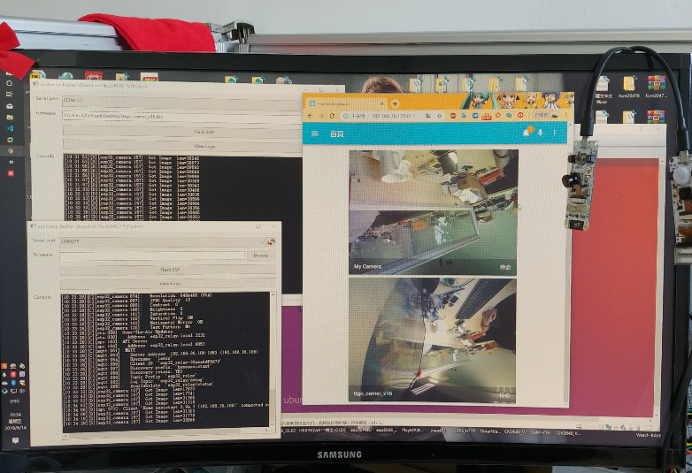

TTGO-Camera-Series
=====================


- Now Arduino officially supports the camera, you need to update the Arduino to the latest, see [arduino-esp32](https://github.com/espressif/arduino-esp32/releases) for details.I am using the `1.0.1rc2` version when writing this code.
  
- In order to support BME280, I will use [Adafruit_BME280_Library](https://github.com/adafruit/Adafruit_BME280_Library), but this library conflicts with <esp_camera.h> and enters [Adafruit_BME280_Library](https://github.com/adafruit/Adafruit_BME280_Library) In Adafruit_BME280_Library change <Adafruit_BME280.h> --> 29 lines comment #include <Adafruit_Sensor.h>, BME280 this library does not use this header file, so comment out and no problem

- OLED requires [esp8266-oled-ssd1306](https://github.com/ThingPulse/esp8266-oled-ssd1306) library support
  
- Buttons require [OneButton](https://github.com/mathertel/OneButton) library support

## Board Modify
- The Camera version sold by TTGO will not have the BME280 sensor, because the temperature on the board affects the accuracy of the sensor. The default program does not enable the BME280 function. If necessary, turn on the `ENABLE_BME280` (on esp32-camera-bme280.ino line 12)
- Add OV2640 microphone version board support, need to enable `TTGO_OV2640_V16` macro for pin conversion, no microphone test, need microphone test please use [T-Camera](https://github.com/Xinyuan-LilyGO/T-Camera)

## TTGO CAM PINS
|  Name  | BME280/NoBME280-Version | Microphone-Version | T-Jornal | T-Camera Plus |
| :----: | :---------------------: | :----------------: | :------: | :-----------: |
|   Y9   |           39            |         36         |    19    |      36       |
|   Y8   |           36            |         15         |    36    |      37       |
|   Y7   |           23            |         12         |    18    |      38       |
|   Y6   |           18            |         39         |    39    |      39       |
|   Y5   |           15            |         35         |    5     |      35       |
|   Y4   |            4            |         14         |    34    |      26       |
|   Y3   |           14            |         13         |    35    |      13       |
|   Y2   |            5            |         34         |    17    |      34       |
|  VSNC  |           27            |         5          |    22    |       5       |
|  HREF  |           25            |         27         |    26    |      27       |
|  PCLK  |           19            |         25         |    21    |      25       |
|  PWD   |           26            |        N/A         |   N/A    |      N/A      |
|  XCLK  |           32            |         4          |    27    |       4       |
|  SIOD  |           13            |         18         |    25    |      18       |
|  SIOC  |           12            |         23         |    23    |      23       |
| RESET  |           N/A           |        N/A         |   N/A    |      N/A      |
|  SDA   |           21            |         21         |    14    |   see Note1   |
|  SCL   |           22            |         22         |    13    |   see Note1   |
| Button |           34            |         0          |    32    |      N/A      |
|  PIR   |           33            |         19         |   N/A    |      N/A      |

- Note1:  The T-Camera Plus I2C is parallel to the camera SIOD SIOC. If you want to use other I2C devices, you need to change the driver code of the underlying driver camera. For details, please refer to [esp32-camera-screen] (https://github.com/lewisxhe/esp32-camera-screen)


* BUTTON Click: Reverse camera ~~Currently the camera reverse color will not be normal, see [issues#9](https://github.com/espressif/esp32-camera/issues/9)~~

* BUTTON LongPress : Enter sleep Mode , ~~Sleep current 6.9mA~~
  
* RESET BUTTON: When the battery is powered, click to turn on the power

* PIR: Detecting human motion and will display the first screen


## Test Video
[YouTube](https://www.youtube.com/watch?v=CibcsmurTbo)


# ESP Home Configure yaml

- TTGO_T_CameraV05
    ```yaml
    esphome:
      name: ttgo_camearv05
      platform: ESP32
      board: esp32dev

    wifi:
      ssid: "ssid"
      password: "password"

    # Enable logging
    logger:

    # Enable Home Assistant API
    api:

    ota:

    mqtt:
      broker: 'ip address'
      username: 'user'
      password: 'password'
    
    # ttgo_camearv05 configuration
    esp32_camera:
      external_clock:
        pin: GPIO32
        frequency: 20MHz
      i2c_pins:
        sda: GPIO13
        scl: GPIO12
      data_pins: [GPIO5, GPIO14, GPIO4, GPIO15, GPIO18, GPIO23, GPIO36, GPIO39]
      vsync_pin: GPIO27
      href_pin: GPIO25
      pixel_clock_pin: GPIO19
      power_down_pin: GPIO26

      # Image settings
      name: ttgo_camearv05
    ```

- TTGO_T_CameraV16
    ```yaml
    esphome:
      name: ttgo_camearv16
      platform: ESP32
      board: esp32dev

    wifi:
      ssid: "ssid"
      password: "password"

    # Enable logging
    logger:

    # Enable Home Assistant API
    api:

    ota:

    mqtt:
    broker: 'ip address'
    username: 'user'
    password: 'password'
    
    # ttgo_camearv16 configuration
    esp32_camera:
      external_clock:
        pin: GPIO4
        frequency: 20MHz
      i2c_pins:
        sda: GPIO18
        scl: GPIO23
      data_pins: [GPIO34, GPIO13, GPIO14, GPIO35, GPIO39, GPIO12, GPIO15, GPIO36]
      vsync_pin: GPIO5
      href_pin: GPIO27
      pixel_clock_pin: GPIO25

      # Image settings
      name: ttgo_camearv16
    ```
    
