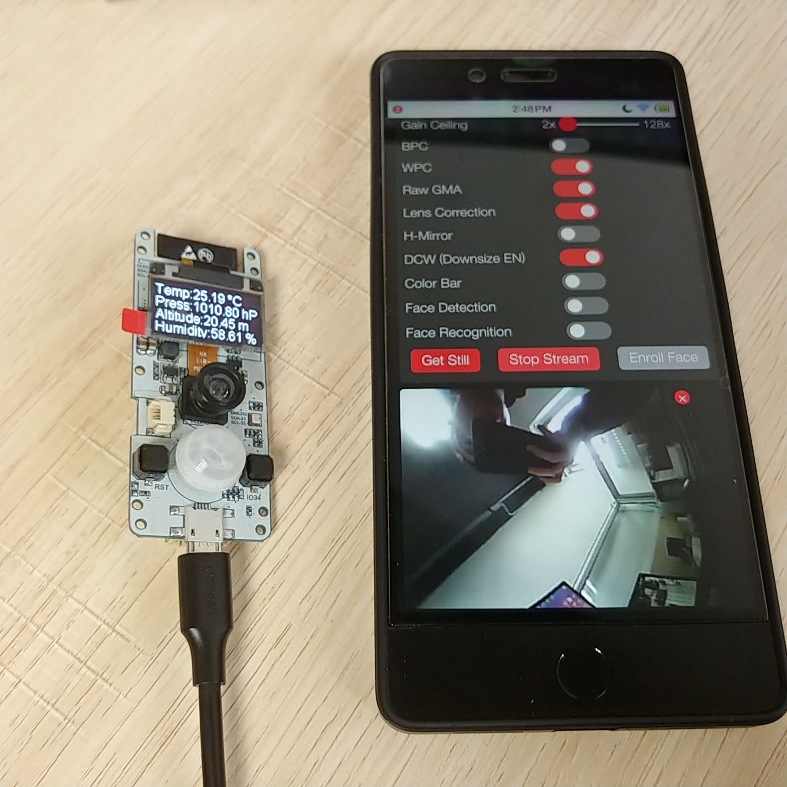

TTGO-Camera
=====================

- Now Arduino officially supports the camera, you need to update the Arduino to the latest, see [arduino-esp32](https://github.com/espressif/arduino-esp32/releases) for details.I am using the `1.0.1rc` version when writing this code.
  
- In order to support BME280, I will use [Adafruit_BME280_Library](https://github.com/adafruit/Adafruit_BME280_Library), but this library conflicts with <esp_camera.h> and enters [Adafruit_BME280_Library](https://github.com/adafruit/Adafruit_BME280_Library) In Adafruit_BME280_Library change <Adafruit_BME280.h> --> 29 lines comment #include <Adafruit_Sensor.h>, BME280 this library does not use this header file, so comment out and no problem

- OLED requires [esp8266-oled-ssd1306](https://github.com/ThingPulse/esp8266-oled-ssd1306) library support
  
- Buttons require [OneButton](https://github.com/mathertel/OneButton) library support

## TTGO CAM PINS
| Name  | Num    |
| ----- | ------ |
| Y9    | 39     |
| Y8    | 36     |
| Y8    | 23     |
| Y7    | 18     |
| Y6    | 15     |
| Y5    | 15     |
| Y4    | 4      |
| Y3    | 2      |
| Y2    | 5      |
| VSNC  | 27     |
| HREF  | 25     |
| PCLK  | 19     |
| PWD   | 26     |
| XCLK  | 32     |
| SIOD  | 13     |
| SIOC  | 12     |
| RESET | No use |

## Sensor & OLED
| Name | Num |
| ---- | --- |
| SDA  | 21  |
| SCL  | 22  |

## Other
| Name   | Num |
| ------ | --- |
| Button | 34  |
| PIR    | 33  |

* BUTTON : Reverse camera ,Currently the camera reverse color will not be normal, see [issues#9](https://github.com/espressif/esp32-camera/issues/9)
  
* PIR: Detecting human motion and will display the first screen

## Test Video
[YouTube](https://www.youtube.com/watch?v=CibcsmurTbo)