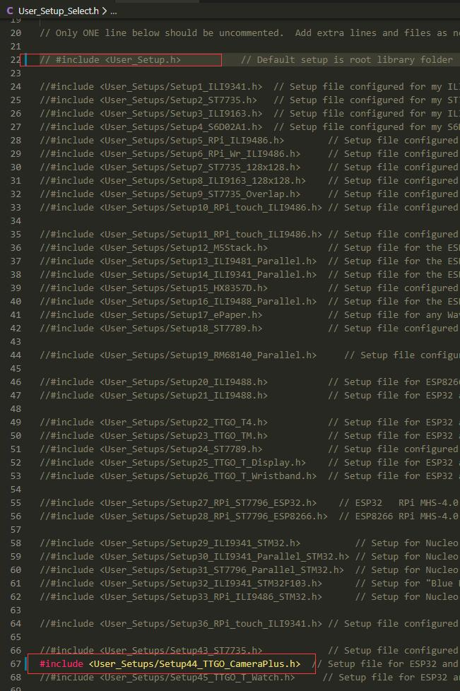

<h1 align = "center">🌟 T Camera Plus 🌟</h1>

|     Name      | T-Camera Plus  |
| :-----------: | :------------: |
|    DVP Y9     |       36       |
|    DVP Y8     |       37       |
|    DVP Y7     |       38       |
|    DVP Y6     |       39       |
|    DVP Y5     |       35       |
|    DVP Y4     |       26       |
|    DVP Y3     |       13       |
|    DVP Y2     |       34       |
|   DVP VSNC    |       5        |
|   DVP HREF    |       27       |
|   DVP PCLK    |       25       |
|    DVP PWD    |      N/A       |
|   DVP XCLK    |       4        |
|   DVP SIOD    |       18       |
|   DVP SIOC    |       23       |
|   DVP RESET   |      N/A       |
|      SDA      | 18 / See Note1 |
|      SCL      | 23 / See Note1 |
|    Button     |      N/A       |
|      PIR      |      N/A       |
|   SPI MISO    |       22       |
|   SPI MOSI    |       19       |
|   SPI SCLK    |       21       |
|    TFT DC     |       15       |
|    TFT RST    |      N/A       |
| TFT BACKLIGHT |       2        |
|   TFT Model   |     ST7789     |
|   TFT Width   |      240       |
|  TFT Height   |      240       |
|   SDCard CS   |       0        |
|    IIS SCK    |       14       |
|    IIS WS     |       32       |
|   IIS DOUT    |       33       |

* Note1 : The T-Camera Plus I2C is parallel to the camera SIOD SIOC.
* Note2 : SD and TFT screen share bus

### Programming Notes:
1. You need to uncomment **T_Camera_PLUS_VERSION** in **sketch.ino**
2. The following libraries need to be installed to compile
    - [Bodmer/TFT_eSPI](https://github.com/Bodmer/TFT_eSPI) 
3. After the installation is complete, enter the **TFT_eSPI** directory, edit **User_Setup_Select.h**, comment the `#include <User_Setup.h>`, and then uuncomment `include <User_Setups/Setup44_TTGO_CameraPlus.h>`

Figure:
    